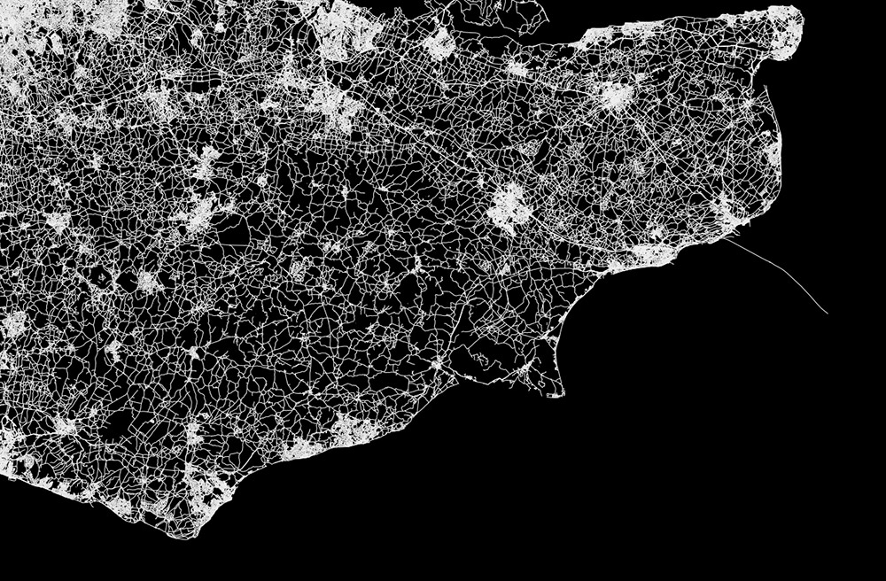
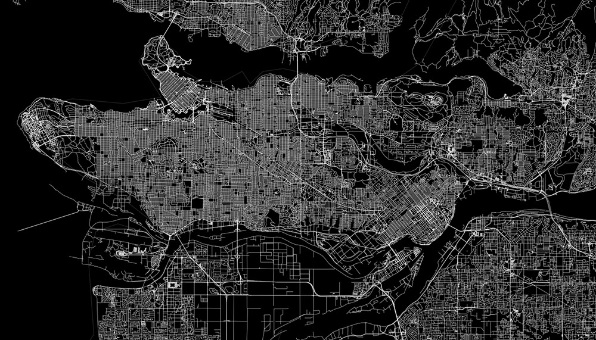
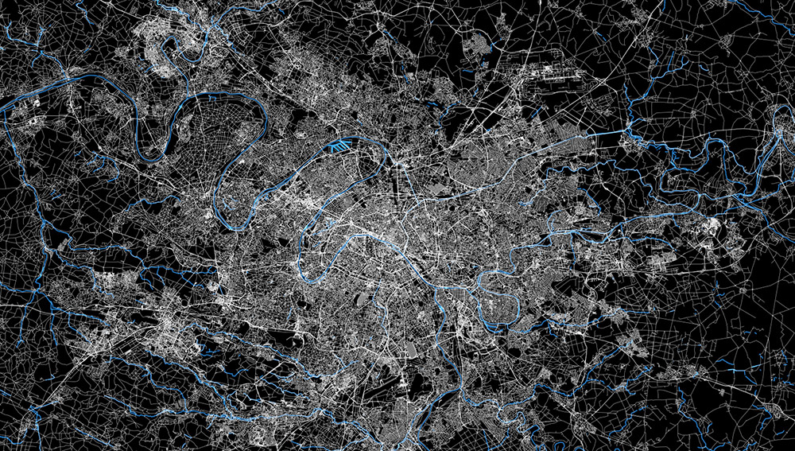
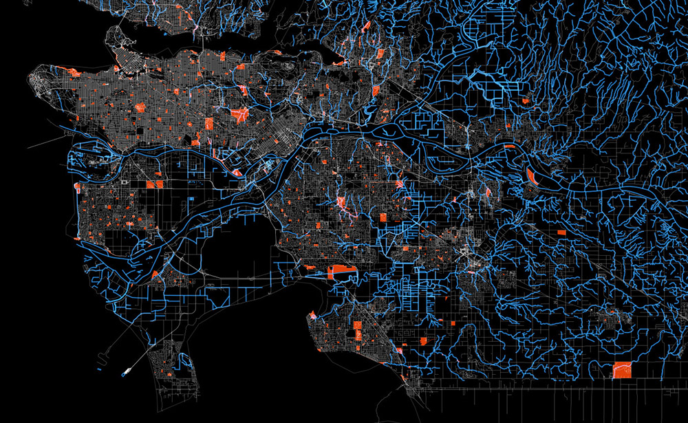

Hello there

All journeys begin with a simple step and this shall be mine — the first post.

Attached are my first sketches explaining how the installation would look/feel and work as well as some of the inspirational material produced so far.

### Sketches

Installation

Tech implementation

Ideas, thoughts and initial conceptualisation

Shapes and procedures

### Inspiration

The mood and feel of the visual lines should resemble very thin threads weaving the city fabric. The sounds should be little noises like crumbling paper and rustles of grasses. The background is deep, but airy (like woods, or howls of wind around the tops of skyscrapers).

At times perhaps a bit chaotic, but sensitive.

London weaved

Rural areas of south-east England weaved

Some cities (most of the North American ones) have been designed for drivers, not walkers — long, gridded motorways.

The European ones have grown out of smaller villages that connected

Water spilling life into Paris

Red spots of parks and blue waterways of London

Man made city fabric of Vancouver and the organic topology of waterways

Now, I'm off for a walk.