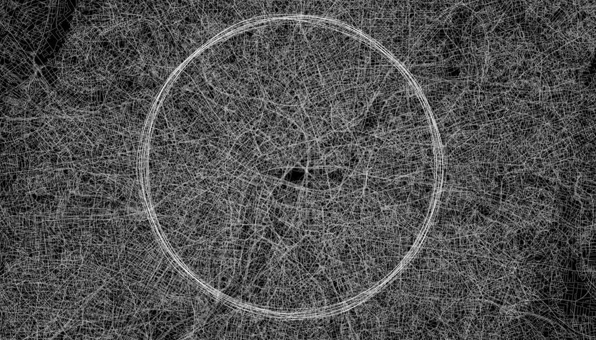
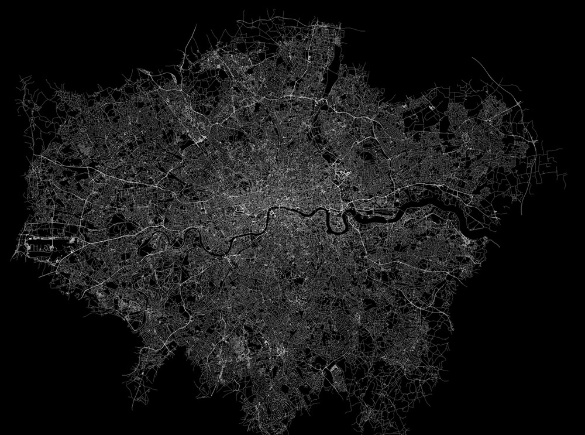
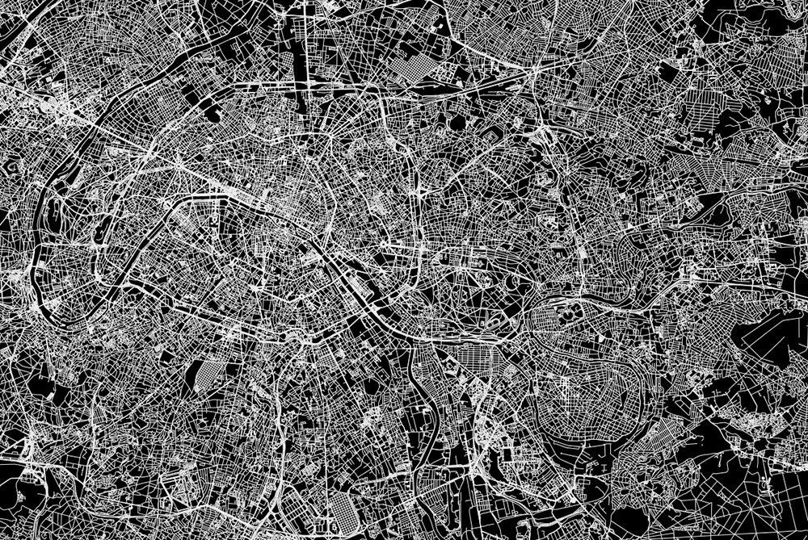
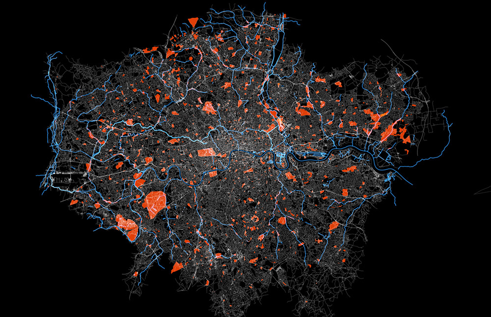

### Inspiration

This post is all about the mood and feel of the project and some of the inspirational material I've created so far.

The visual lines should resemble very thin threads weaving the city fabric. The sounds should be little noises like crumbling paper and rustles of grasses. The background is deep, but airy (like woods, or howls of wind around the tops of skyscrapers).

At times perhaps a bit chaotic, but sensitive.

London weaved

Rural areas of south-east England weaved

Some cities (most of the North American ones) have been designed for drivers, not walkers — long, gridded motorways.

The European ones have grown out of smaller villages that connected

Water spilling life into Paris

Red spots of parks and blue waterways of London

Man made city fabric of Vancouver and the organic topology of waterways
