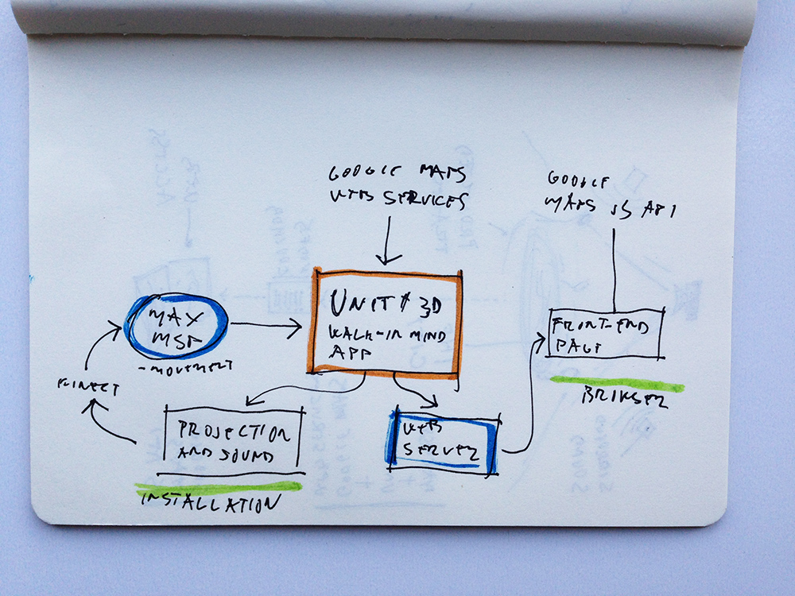
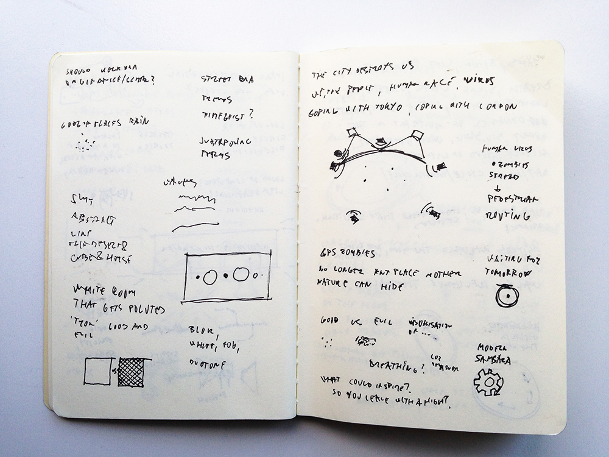
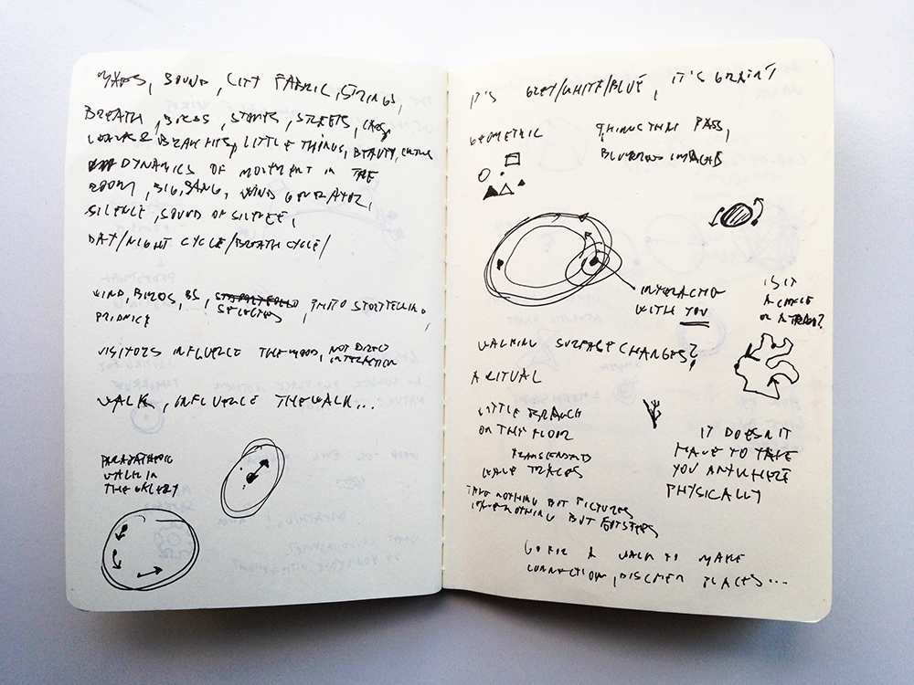
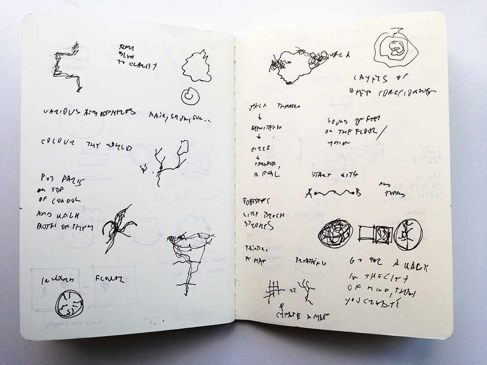

Hello there

All journeys begin with a simple step and this shall be mine — the first post.

Attached are my first sketches explaining how the installation work. In the second post I'll be attaching some inspiration material.

### Sketches

Installation

Tech implementation

Ideas, thoughts and initial conceptualisation

Shapes and procedures

Now, I'm off for a walk.