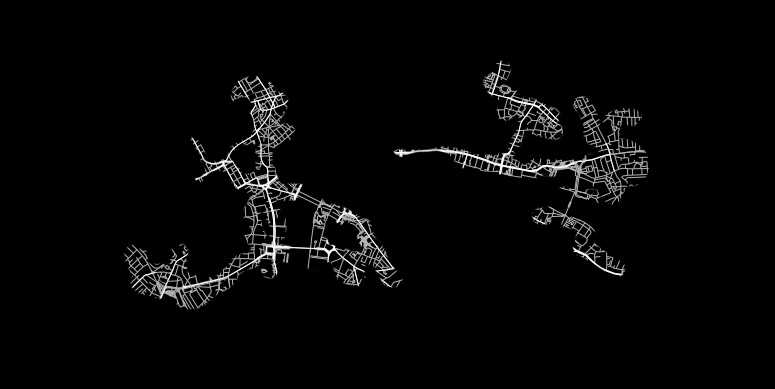
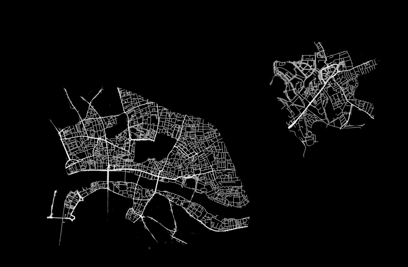
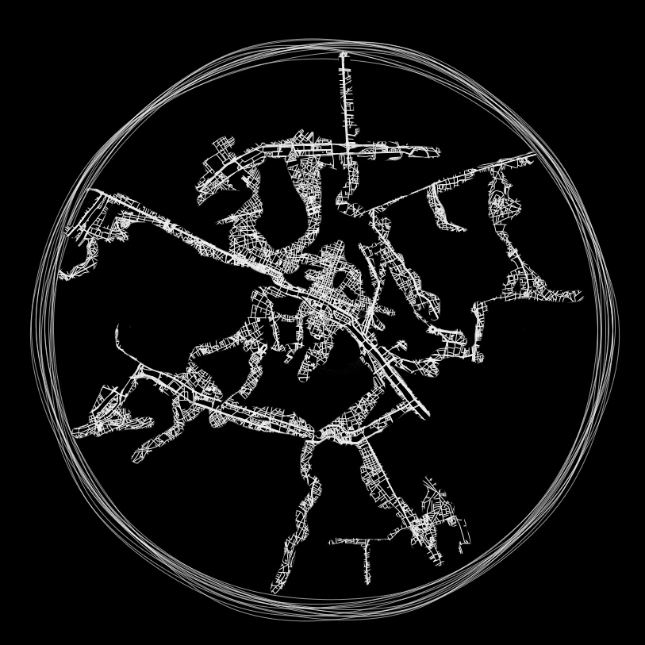

# Project Title
Walk-in Mind

## Authors
- Peter Koraca, [pkorac](https://github.com/pkorac)

## Description
Walking offers not just the possibility of moving our physical selves; to ancient Greeks it was a way of transferring knowledge, to Buddhists it is meditation in motion. Buddhism teaches that the mind has a neutral quality, can be trained and is moulded by the thoughts and emotions we expose it to. In doing that we are the creators of our own realities.

Walk-in mind is an interactive installation composed of 3-4 minute sessions in which visitors walk around a projected circle. Their act of walking generates real-time procedural drawings of re-imagined cityscapes. Motion detection interprets their movements and affects the various parameters of the generative city inside it. Google maps services provide the initial conditions and setting for the city's growth and properties. Maps JS api allows the visitors to later access their creation from web.

Enjoying long walks and being fascinated by maps I feel really passionate about taking the two beyond the physical.

## Links to External Libraries

- [Unity3D](http://unity3d.com)
- [MaxMSP](http://cycling74.com)
- [Google Maps Javascript API](https://developers.google.com/maps/documentation/javascript)
- [Google Maps API Web Services](https://developers.google.com/maps/documentation/webservices)
- [Google Chrome](https://www.google.com/intl/en/chrome/browser)
- [Nodejs](http://nodejs.org)
- [CouchDB](http://couchdb.apache.org)

## Images & Videos

### Initial (photoshop-ed) mockups of a city fabric growing

Main and side streets forming — a lot of empty space (like in rural towns)

A few "big roads" and a lot of smaller streets connecting — densely populated (central London)

City growing within the circle — rural version of Paris (main road along the embankment with few small streets branching out, vast empty areas between them)

Peter Koraca, 2014

[www.peterkoraca.com](http://www.peterkoraca.com)
